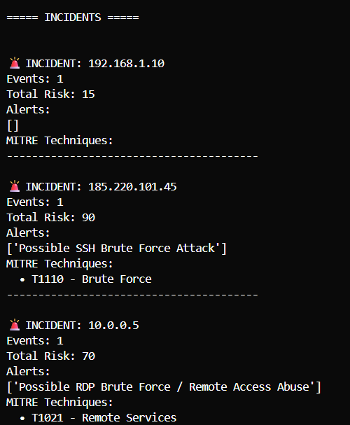
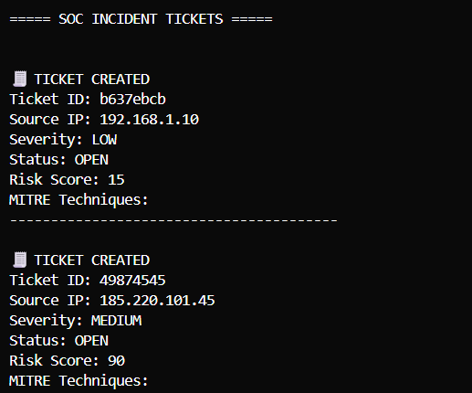
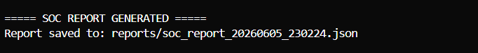

# 🛡️ Network Security Monitoring & SOC Simulation Engine

---

## 📌 Overview

The **Network Security Monitoring & SOC Simulation Engine** is a Python-based SOC (Security Operations Center) simulation tool that processes network traffic data, detects suspicious activity, enriches alerts with MITRE ATT&CK mappings, correlates incidents, assigns risk scores, and generates SOC-style incident tickets and reports.

> Designed to simulate real-world SOC analyst workflows for educational and portfolio purposes.

---

## 🎯 Key Features

| Feature | Description |
|---|---|
| 🌐 Traffic Processing | Parses simulated network logs, extracting IP, port, protocol, and connection data |
| 🚨 Threat Detection | Detects SSH brute force, RDP abuse, port scanning, HTTP floods, and DNS anomalies |
| 🧠 MITRE ATT&CK Mapping | Enriches every detection with adversary context and technique classification |
| 📊 Risk Scoring | Assigns scores from 0–100 and classifies severity across four levels |
| 🔗 Incident Correlation | Groups related events by source IP into unified security incidents |
| 🧾 SOC Ticketing | Generates incident tickets with severity, status, and ticket ID tracking |
| 📄 SOC Reporting | Exports structured JSON reports for documentation and analysis |

---

## 🏗️ Architecture
Network Traffic → Detection Engine → MITRE Mapper → Risk Scoring → Incident Correlation → Ticketing → SOC Report

---

## 🧭 MITRE ATT&CK Coverage

| Detection Type | MITRE ID | Technique |
|---|---|---|
| SSH Brute Force | T1110 | Brute Force |
| RDP Abuse | T1021 | Remote Services |
| Port Scanning | T1595 | Active Scanning |
| HTTP Flood | T1498 | Network DoS |
| DNS Abuse | T1071.004 | DNS Protocol |

---

## 🔎 Risk Classification Levels

| Level | Risk Score Range | Description |
|---|---|---|
| 🟢 LOW | 0 – 39 | Minimal threat, monitor only |
| 🟡 MEDIUM | 40 – 69 | Elevated risk, investigate |
| 🔴 HIGH | 70 – 89 | Active threat, respond promptly |
| ⛔ CRITICAL | 90 – 100 | Confirmed threat, immediate action |

---

## 📊 Example Output
INCIDENT       : 185.220.101.45
Events         : 3
Total Risk     : 185
Alert          : Possible SSH Brute Force Attack
MITRE          : T1110 — Brute Force
Ticket ID      : a93k2f1
Severity       : HIGH
Status         : OPEN
Report         : reports/incident_report_2024.json exported

---

## 🚀 Getting Started

### 1. Clone the repository
git clone https://github.com/your-username/network-soc-simulation-engine.git
cd network-soc-simulation-engine

### 2. Install dependencies
pip install -r requirements.txt

### 3. Run the engine
python main.py

---

## 📁 Project Structure

<pre>
network-soc-simulation-engine/
│
├── main.py                    # SOC engine entry point
├── requirements.txt           # Dependencies
├── README.md                  # Project documentation
│
├── src/
│   ├── traffic_parser.py      # Network traffic ingestion
│   ├── detection_engine.py    # Threat detection logic
│   ├── mitre_mapper.py        # MITRE ATT&CK mapping
│   ├── risk_engine.py         # Risk scoring and classification
│   ├── incident_correlator.py # Incident correlation logic
│   ├── ticket_system.py       # SOC ticketing system
│   └── report_exporter.py     # JSON report generation
│
├── data/
│   └── sample_traffic.json    # Sample network traffic logs
│
└── reports/                   # Generated SOC reports
</pre>

---

## 🧠 SOC Skills Demonstrated

- ✅ Network traffic analysis and parsing
- ✅ Threat detection engineering
- ✅ MITRE ATT&CK framework mapping
- ✅ Security risk scoring and classification
- ✅ Incident correlation and grouping
- ✅ SOC ticket lifecycle management
- ✅ Structured security reporting and documentation

---

## 🛠️ Technologies Used

- Python 3.8+
- JSON
- Custom detection logic
- MITRE ATT&CK framework (simulation-based mapping)

---

## 📌 Use Cases

This project is designed for:

- 🎯 SOC Analyst and Detection Engineer portfolio development
- 📚 Network security learning and hands-on practice
- 🖥️ SIEM and SOC workflow simulation
- 💼 Interview demonstrations and assessments

---

## 📸 Screenshots

### 🚨 Incident Detection Output
Shows detected threats, risk scoring, and MITRE ATT&CK mapping.

---

### 🔗 Incident Correlation View
Shows how multiple alerts are grouped into a single security incident.

---

### 🧾 SOC Ticket Output
Shows generated SOC tickets with severity, status, and metadata.

---

### 📄 JSON SOC Report Export
Shows structured incident reporting in JSON format for SOC workflows.

---

## 👤 Author

**Ntsika Xhali**  
Junior SOC Analyst | SOC Simulation | Threat Intelligence

---

## ⚠️ Disclaimer

This project is a simulated SOC monitoring tool built for **educational and cybersecurity portfolio purposes only**. It does not interact with any real or production security systems.
